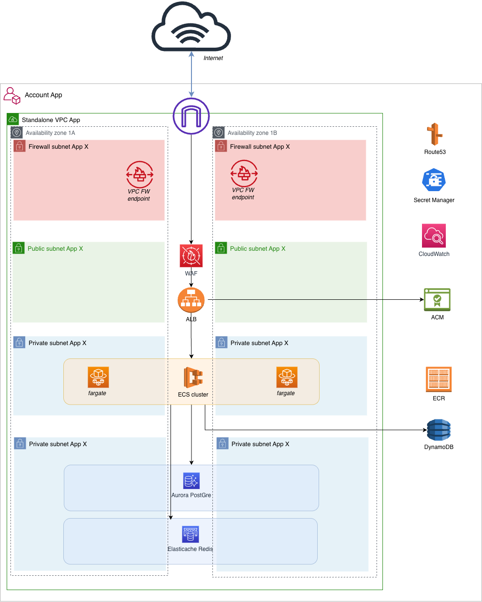

# Terraform Blueprint: ECS Standalone

[](https://www.terraform.io/)
[](https://aws.amazon.com/ecs/)
[](#shared-terraform-modules-aws)
[](LICENSE)

> Production-ready Terraform blueprint for deploying containerized applications on AWS ECS Fargate with centralized Terraform modules, GitHub Actions delivery, CloudWatch monitoring and Security by design.

---

## Table of Contents

- [Overview](#-overview)
- [Architecture](#-architecture)
- [Features](#-features)
- [Prerequisites](#-prerequisites)
- [Quick Start](#-quick-start)
- [Multi-Environment Setup](#-multi-environment-setup)
- [Container Deployment Flow](#container-deployment-flow)
- [Repository Structure](#repository-structure)
- [Shared Terraform Modules](#shared-terraform-modules-aws)
- [Configuration Guide](#configuration-guide)
- [CI/CD Workflow](#-cicd-workflow)
- [Common Operations](#common-operations)
- [Monitoring And Operations](#-monitoring-and-operations)
- [Troubleshooting](#troubleshooting)
- [Contributing](#-contributing)
- [License](#license)

---

## Overview

The ECS Standalone blueprint is a **production-ready infrastructure-as-code template** for deploying **secure, scalable, and highly available containerized applications** on AWS ECS Fargate.

This repository **composes modules for a specific ECS architecture**. The reusable module code lives in the `terraform-modules-aws` repository.

### Key Features

- **Zero Manual Setup** - Terraform delivery is automated through GitHub Actions
- **Serverless Containers** - Runs application workloads on ECS Fargate without EC2 capacity management
- **Multi-Environment** - Supports `dev` and `prod` environment folders
- **Secure by Default** - KMS encryption, ECS IAM roles, and security groups
- **Monitoring Built-in** - CloudWatch dashboard, alarms, logs, and SNS notifications
- **Centralized Modules** - Consumes released modules from `terraform-modules-aws`

---

## Architecture



### High-Level Flow

1. Users access the service through a custom DNS name managed in Route 53.
2. ACM provides the TLS certificate used by the Application Load Balancer.
3. The ALB forwards HTTPS traffic to the ECS service target group.
4. ECS Fargate runs the application containers in private subnets.
5. The ECS task execution role pulls images from ECR and writes logs to CloudWatch.
6. Application runtime permissions are provided by the ECS task role.
7. Aurora, Redis, DynamoDB, Secrets Manager, and SSM provide data and configuration services.
8. CloudWatch dashboards and alarms provide operational visibility.

### Infrastructure Components

| Layer | AWS Service | Purpose |
| --- | --- | --- |
| Network | Existing VPC and subnets | Public subnets for ALB, private subnets for Fargate and data services |
| Load balancing | Application Load Balancer | HTTPS entry point and target health checking |
| Compute | ECS Fargate | Serverless container runtime |
| Registry | Amazon ECR | Private Docker image repository |
| Identity | ECS IAM roles | Task execution and application runtime permissions |
| Database | Aurora PostgreSQL | Relational database backend |
| Cache | ElastiCache Redis | Cache or session storage |
| NoSQL | DynamoDB | Optional table for sessions, flags, or high-throughput key-value access |
| Secrets | Secrets Manager and SSM | Secret and configuration distribution |
| Encryption | AWS KMS | Customer-managed keys for data services |
| Observability | CloudWatch and SNS | Dashboards, alarms, logs, and email notifications |

---

## Features

### Infrastructure

- ECS Fargate service with no EC2 capacity management
- Private ECR repository for application container images
- HTTPS entry point through an Application Load Balancer
- SSL/TLS certificates with automated DNS validation through Route 53
- ECS task definition, service, CloudWatch log group, and task IAM roles
- Aurora PostgreSQL cluster for relational data
- ElastiCache Redis for cache or session storage
- Optional DynamoDB tables for NoSQL workloads
- KMS keys for RDS, Secrets Manager, DynamoDB, and Redis encryption
- Secrets Manager and SSM Parameter Store integration for application configuration

### Operations

- Two-phase deployment pattern: validate the platform with nginx, then deploy the application image
- Docker image build and push workflow through ECR
- GitHub Actions workflows for Terraform plan, apply, destroy, and formatting checks
- CloudWatch dashboard for ALB, ECS, Aurora, and Redis metrics
- CloudWatch alarms with SNS email notifications
- Module consumption from the central `terraform-modules-aws` repository using pinned Git tags

---

## Prerequisites

### Local Tools

Terraform operations are executed by **GitHub Actions**. Local tools are only required for **repository changes** and **optional application image workflows**.

| Tool | Required For | Notes |
| --- | --- | --- |
| Git >= 2.0 | Standard workflow | Clone the repository, create branches, commit, and push changes |
| Docker >= 20.0 | Manual container publishing | Build and test application images before pushing to ECR |
| AWS CLI >= 2.0 | Manual container publishing | Authenticate to ECR and push images |
| Terraform >= 1.9 | Optional local validation | Useful for `terraform fmt` or local reviews; plan/apply runs in GitHub Actions |

### Required AWS And Platform Inputs

- AWS account with permissions for ECS, ECR, ALB, RDS, Route 53, ACM, KMS, IAM, CloudWatch, SNS, SSM, Secrets Manager, DynamoDB, and ElastiCache
- Existing VPC with public and private subnets
- Route 53 hosted zone for the application domain
- GitHub repository with Actions enabled
- GitHub OIDC role configured for AWS authentication
- Docker build environment compatible with the target ECS CPU architecture

---

## Quick Start

Use this repository by **configuring an environment folder**, then **pushing the change** so GitHub Actions can run the Terraform workflows.

### 1. Clone And Configure

```bash
# Clone repository
git clone <repository-url>
cd terraform-blueprint-ecs-standalone

# Configure environment
cd infrastructure/environments/dev
cp terraform.tfvars.example terraform.tfvars
vim terraform.tfvars
```

> **Recommended for the first deployment**
> Keep a simple image such as `nginx:latest` until the platform is validated.

### 2. Essential Configuration

The minimum settings to review are **networking**, **DNS**, **container image**, **ECS sizing**, **database**, and **monitoring email**.

Edit `infrastructure/environments/dev/terraform.tfvars`:

```hcl
# Project
project_name = "ecs-standalone"
environment  = "dev"
region       = "eu-west-1"

# Networking (your existing VPC)
vpc_id             = "vpc-xxxxx"
public_subnet_ids  = ["subnet-xxxxx", "subnet-yyyyy"]
private_subnet_ids = ["subnet-zzzzz", "subnet-aaaaa"]

# DNS (your Route 53 hosted zone)
domain_name = "app.your-domain.com"
zone_name   = "your-domain.com"
zone_id     = "Z0XXXXXXXXXXXXX"

# IAM Permission Boundary
permissions_boundary_arn = "arn:aws:iam::<AWS_ACCOUNT_ID>:policy/YourPermissionBoundary"

# Container Configuration (Phase 1: nginx)
container_image = "nginx:latest"
container_port  = 80
health_check_path = "/"

# ECS Sizing
ecs_desired_count = 2
task_cpu          = 256
task_memory       = 512

# Database
db_name     = "appdb"
db_username = "dbadmin"

# Monitoring
alert_email = "your-email@company.com"
```

### 3. Review The Environment Files

The environment folder contains the Terraform entry point for this deployment:

```text
main.tf
variables.tf
terraform.tfvars
backend.tf
monitoring.tf
outputs.tf
```

For **production**, make the equivalent changes under `infrastructure/environments/prod`.

### 4. Deploy Via GitHub Actions

```bash
# Commit configuration
git add infrastructure/environments/dev/terraform.tfvars
git commit -m "feat: configure dev ecs environment"

# Push to trigger deployment workflow
git push origin <branch-name>
```

GitHub Actions will:

1. run the `terraform-plan` workflow to show the proposed changes
2. display the `Plan Run ID` in the workflow summary
3. wait for review and approval
4. run the `terraform-apply` workflow when manually triggered by an authorized user

> **Apply workflow**
> Open the completed `terraform-plan` run in GitHub Actions and copy the **Plan Run ID** from the workflow summary. Then open `Terraform Apply`, click `Run workflow`, select the same environment, paste the **Plan Run ID**, and type `APPLY` in the confirmation field.

### 5. Confirm SNS Email

Check your email for the **AWS SNS subscription confirmation** and click `Confirm subscription`.

### 6. Access Application

Your application will be available at:

```text
https://app.your-domain.com
```

For a first deployment using `nginx:latest`, you should see the **nginx welcome page**.

---

## Multi-Environment Setup

Create additional environments by copying the `dev` folder:

```bash
cp -r infrastructure/environments/dev infrastructure/environments/prod
vim infrastructure/environments/prod/terraform.tfvars
# Update values for production
```

---

## Container Deployment Flow

### Phase 1: Validate The Platform With nginx

Start with:

```hcl
container_image = "nginx:latest"
container_port  = 80
health_check_path = "/"
```

Deploying nginx first validates the **ALB**, **target group**, **Fargate networking**, **DNS**, **TLS**, and **monitoring** before introducing an application-specific image.

### Phase 2: Build And Push Your Application Image

```bash
cd docker-app

docker build --platform linux/amd64 -t ecs-standalone-app:v1.0 .

aws ecr get-login-password --region eu-west-1 \
  | docker login --username AWS --password-stdin <account-id>.dkr.ecr.eu-west-1.amazonaws.com

docker tag ecs-standalone-app:v1.0 \
  <account-id>.dkr.ecr.eu-west-1.amazonaws.com/ecs-standalone-dev:v1.0

docker push <account-id>.dkr.ecr.eu-west-1.amazonaws.com/ecs-standalone-dev:v1.0
```

> **Important**
> Use `--platform linux/amd64` when building from an ARM workstation if the ECS task runs on x86_64.

### Phase 3: Update Terraform Configuration

```hcl
container_image = "<account-id>.dkr.ecr.eu-west-1.amazonaws.com/ecs-standalone-dev:v1.0"
```

Commit, push, review the plan, then run apply.

---

## Repository Structure

```text
docker-app/                  Example application used for container validation
infrastructure/
  bootstrap/backend/          Backend bootstrap configuration for remote state resources
  environments/dev/           Development environment configuration
  environments/prod/          Production environment configuration
  monitoring/                 Dashboard templates shared by environments
docs/
  images/                     Architecture diagrams
.github/workflows/            Terraform plan, apply, destroy, fmt, and quality workflows
README.md                     Repository entry point
```

There are no local Terraform modules in this blueprint. Modules are consumed from the central `terraform-modules-aws` repository through pinned Git tags.

---

## Shared Terraform Modules

This blueprint consumes released modules from:

```text
git::ssh://git@github.com/your-org/terraform-modules-aws.git//modules/<module>?ref=v1.0.0
```

| Module | Used For |
| --- | --- |
| `backend` | S3 and KMS resources for Terraform remote state bootstrap |
| `security-groups` | ALB, ECS, database, and Redis security group rules |
| `acm-alb` | TLS certificate and DNS validation for ALB traffic |
| `alb` | Application Load Balancer, listener, target group, and ALB alarms |
| `kms` | Keys for RDS, Secrets Manager, DynamoDB, and Redis encryption |
| `ecr` | Private container image repository |
| `ecs` | ECS cluster, task definition, service, CloudWatch log group, and ECS IAM roles |
| `secrets-manager` | Generated database password storage |
| `aurora` | Aurora PostgreSQL cluster and instances |
| `dynamodb` | Optional DynamoDB table |
| `elasticache` | Redis replication group and subnet group |
| `ssm-parameters` | Application, database, and Redis configuration parameters |
| `monitoring` | CloudWatch dashboard, alarms, SNS topic, and subscriptions |

> **Important IAM Note**
> This blueprint does **not** consume the standalone `iam` module. ECS IAM resources are created inside the central `ecs` module.

---

## Configuration Guide

### ECS Service

```hcl
ecs_desired_count = 2
task_cpu          = 512
task_memory       = 1024
```

Scale by increasing **desired count** or **task size**. Review Fargate quota and cost impact before production changes.

### IAM

The central `ecs` module creates:

- a task execution role used by ECS to pull ECR images, write CloudWatch logs, and read configured secrets
- a task role used by application code running inside the container

Application-specific permissions can be added through:

```hcl
task_custom_policies     = {}
task_managed_policy_arns = []
```

Keep these policies as **narrow as possible**.

### Secrets And Parameters

Database credentials are stored in Secrets Manager. Connection values are exposed through SSM Parameter Store. Applications can read them when the ECS task IAM permissions allow it.

### Data Services

Aurora, Redis, and DynamoDB are optional from an application perspective, but the blueprint includes them as part of the reference architecture. Disable or adapt them only after reviewing dependencies in `main.tf`, `variables.tf`, and `outputs.tf`.

---

## CI/CD Workflow

| Workflow | Trigger | Purpose |
| --- | --- | --- |
| `terraform-plan` | Push/PR to `dev` or `main` | Preview infrastructure changes |
| `terraform-apply` | Manual approval after plan | Deploy reviewed infrastructure changes |
| `terraform-destroy` | Manual trigger | Destroy all resources |
| `terraform-fmt` | Manual trigger | Auto-format Terraform code |
| `sonarqube-quality-scan` | Push/PR to `dev` or `main` | Code quality analysis |

### Branch Strategy

| Branch | Environment | Deployment |
| --- | --- | --- |
| `dev` | `dev` | Automatic plan, manual apply |
| `main` | `prod` | Automatic plan, manual apply |

### Typical Workflow

```bash
# 1. Make changes
vim infrastructure/environments/dev/terraform.tfvars

# 2. Commit and push
git add .
git commit -m "feat: update dev environment configuration"
git push origin dev

# 3. GitHub Actions runs terraform-plan automatically
# 4. Review plan in GitHub Actions logs and copy the Plan Run ID
# 5. Manually trigger terraform-apply workflow with the Plan Run ID if approved
```

### GitHub Secrets Required

```text
TERRAFORM_MODULES_SECRET_KEY  # SSH private key used to consume terraform-modules-aws
SONAR_TOKEN                   # SonarQube authentication token
```

### GitHub Variables Required

```text
DEV_DEPLOY_AWS_ROLE_TO_ASSUME   # AWS role ARN for dev deployments
PROD_DEPLOY_AWS_ROLE_TO_ASSUME  # AWS role ARN for prod deployments
SONAR_PROJECT_KEY               # SonarQube project key
```

These role ARNs are used by **GitHub Actions through OIDC** to assume the target AWS deployment role.

---

## Common Operations

### Scale The Service

```hcl
ecs_desired_count = 3
task_cpu          = 1024
task_memory       = 2048
```

Commit, push, review the plan, then apply.

### Deploy A New Container Version

```hcl
container_image = "<account-id>.dkr.ecr.eu-west-1.amazonaws.com/ecs-standalone-dev:v1.1"
```

Use **immutable image tags** for production releases.

### Enable Execute Command

```hcl
ecs_enable_execute_command = true
```

Confirm the **platform security policy** allows ECS Exec before enabling it in production.

### Destroy An Environment

Use the `terraform-destroy` GitHub Actions workflow. The **backend resources** are intentionally managed separately and should not be destroyed as part of normal environment teardown.

---

## Monitoring And Operations

The monitoring layer creates a CloudWatch dashboard, SNS email notifications, and alarms for the ECS service and supporting data services.

### Dashboard

Access the dashboard from AWS Console -> CloudWatch -> Dashboards.

Dashboard name pattern:

```text
<project_name>-<environment>-dashboard
```

Example:

```text
ecs-standalone-dev-dashboard
```

The dashboard includes:

- ALB metrics: request count, target response time, target health, and HTTP response codes
- ECS Fargate metrics: CPU utilization, memory utilization, running task count, and service health
- Aurora metrics: database connections, CPU utilization, read/write latency, and freeable memory
- Redis metrics: cache hit rate, evictions, CPU utilization, and memory usage

The dashboard layout is defined in `infrastructure/monitoring/dashboard.json.tftpl`.

### Configuration

Monitoring is configured per environment:

| File | Purpose |
| --- | --- |
| `infrastructure/environments/<env>/monitoring.tf` | Defines dashboard inputs, CloudWatch alarms, and the shared monitoring module call |
| `infrastructure/monitoring/dashboard.json.tftpl` | Defines the CloudWatch dashboard widgets |
| `infrastructure/environments/<env>/terraform.tfvars` | Sets `alert_email`, `database_connection_threshold`, and monitoring thresholds |
| `infrastructure/environments/<env>/variables.tf` | Declares monitoring threshold variables |

To receive alarm notifications, set `alert_email` in the target environment and confirm the **AWS SNS subscription email** after deployment.

### Alarms

The current environment monitoring defines these CloudWatch alarms:

| Alarm | Severity | Metric | Threshold | Action |
| --- | --- | --- | --- | --- |
| ALB Unhealthy Targets | CRITICAL | `UnHealthyHostCount` | `monitoring_unhealthy_target_threshold` | Email via SNS |
| ALB 5xx Errors | CRITICAL | `HTTPCode_Target_5XX_Count` | `monitoring_alb_5xx_threshold` | Email via SNS |
| ECS Task Count Low | CRITICAL | `RunningTaskCount` | `< 1` | Email via SNS |
| Aurora High Connections | CRITICAL | `DatabaseConnections` | `database_connection_threshold` | Email via SNS |
| Redis Low Cache Hit Rate | CRITICAL | `CacheHitRate` | `< monitoring_redis_cache_hit_rate_threshold` | Email via SNS |
| Redis High Evictions | CRITICAL | `Evictions` | `monitoring_redis_evictions_threshold` | Email via SNS |
| ALB High Response Time | WARNING | `TargetResponseTime` | `monitoring_alb_response_time_threshold` | Email via SNS |
| ECS High CPU | WARNING | `CPUUtilization` | `monitoring_ecs_cpu_threshold` | Email via SNS |
| ECS High Memory | WARNING | `MemoryUtilization` | `monitoring_ecs_memory_threshold` | Email via SNS |
| Aurora High CPU | WARNING | `CPUUtilization` | `monitoring_db_cpu_threshold` | Email via SNS |
| Aurora High Read Latency | WARNING | `ReadLatency` | `monitoring_db_read_latency_threshold` | Email via SNS |
| Redis High CPU | WARNING | `CPUUtilization` | `monitoring_redis_cpu_threshold` | Email via SNS |

Email notifications are sent to the address configured in `alert_email` variable.

### Example: Investigating An ALB 503

1. Open the target group attached to the ECS service and confirm whether targets are `healthy`, `unhealthy`, or missing.
2. Open the ECS service and review recent service events for task restarts, failed deployments, or health check failures.
3. Check the running task count against the desired count.
4. Open CloudWatch Logs for the application container and look for startup failures or binding errors.
5. Confirm the ALB health check path, port, and success codes match the application behavior.
6. Review security group rules between the ALB and ECS tasks if targets remain unreachable.

---

## Troubleshooting

| Symptom | Likely Cause | What To Check |
| --- | --- | --- |
| ECS task stops immediately | Application startup failure or image architecture mismatch | Container logs, stopped task reason, image build platform |
| Image cannot be pulled | ECR authentication, repository, or task execution role issue | ECR image URI, repository permissions, execution role |
| ALB returns 503 | No healthy ECS targets | Target health, task health check route, security groups |
| Secrets cannot be read | Missing task execution permissions or wrong ARN | `secrets_manager_arns`, `kms_key_arns`, execution role policy |
| No alert emails received | SNS subscription not confirmed | Inbox, spam folder, SNS subscription status |
| Terraform plan cannot assume role | OIDC role or GitHub environment mismatch | `DEV_DEPLOY_AWS_ROLE_TO_ASSUME`, `PROD_DEPLOY_AWS_ROLE_TO_ASSUME`, trust policy, branch/environment settings |

---

## Contributing

1. Create a feature branch.
2. Keep changes scoped to one environment or one concern.
3. Run formatting locally if Terraform is installed:

```bash
terraform fmt -recursive
```

4. Commit with a clear message.
5. Push and review the GitHub Actions plan.

Use the central `terraform-modules-aws` repository for reusable module changes. Use this blueprint repository for ECS architecture composition, application configuration, and environment-specific settings.

---

## License

This project is licensed under the Apache License, Version 2.0. See [LICENSE](LICENSE) for details.

---

Built with ❤️ by Auré
